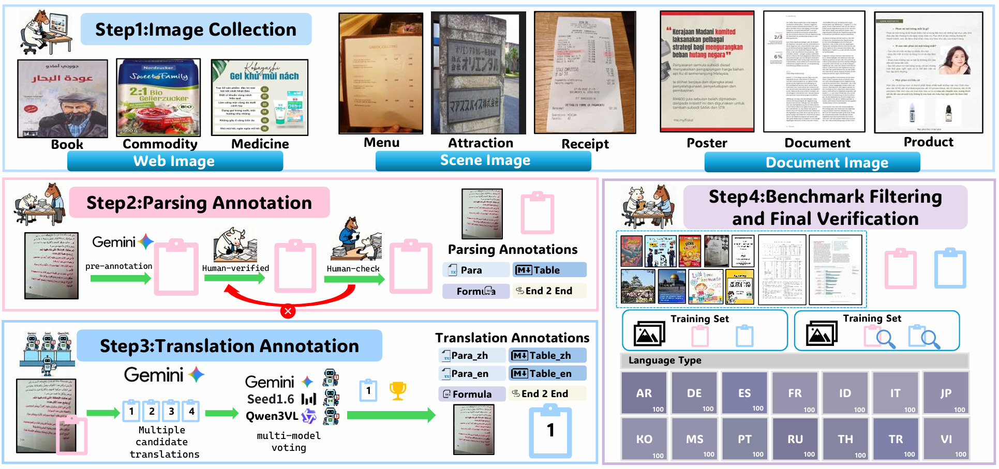

# MMTIT-Bench

**多语言多场景文本图像机器翻译基准 · 认知-感知-推理引导的翻译范式**

<p align="center">
  <a href="https://huggingface.co/datasets/VirtualLUO/MMTIT_Bench">English</a> •
  <a href="https://arxiv.org/abs/2603.23896">论文</a>
</p>

## 概述

**MMTIT-Bench** 是一个经人工验证的端到端文本图像机器翻译（TIMT）基准，包含 **1,400 张图片**，覆盖 **14 种非英非中语言**，涵盖文档、菜单、书籍、海报、景点等多种真实场景，每张图片附有中英双语翻译标注。

我们同时提出 **CPR-Trans**（认知-感知-推理翻译）数据范式，在统一的思维链框架中整合场景认知、文本感知与翻译推理。

<p align="center">
  
</p>

## 基准统计

| 项目 | 详情 |
|------|------|
| 图片总数 | 1,400 |
| 语言 | 14种（阿拉伯语、德语、西班牙语、法语、印尼语、意大利语、日语、韩语、马来语、葡萄牙语、俄语、泰语、土耳其语、越南语） |
| 翻译方向 | 其他语言→中文、其他语言→英文 |
| 场景 | 文档、菜单、书籍、景点、海报、商品等 |
| 标注 | 人工校验的 OCR + 双语翻译 |

## 数据格式

### 目录结构

```
MMTIT-Bench/
├── README.md               # 英文说明
├── README_ZH.md            # 中文说明
├── annotation.jsonl        # 基准标注数据
├── images.zip              # 基准图片
├── eval_comet_demo.py      # COMET 评估脚本
└── prediction_demo.jsonl   # 预测文件示例
```

### 标注格式（`annotation.jsonl`）

每行一个 JSON 对象：

```json
{
    "image_id": "Korea_Menu_20843.jpg",
    "parsing_anno": "멜로우스트리트\n\n위치: 서울특별시 관악구...",
    "translation_zh": "梅尔街\n\n位置：首尔特别市 冠岳区...",
    "translation_en": "Mellow Street\n\nLocation: 1st Floor, 104 Gwanak-ro..."
}
```

| 字段 | 说明 |
|------|------|
| `image_id` | 图片文件名，格式为 `{语言}_{场景}_{ID}.jpg` |
| `parsing_anno` | OCR 文本解析标注（原始语言） |
| `translation_zh` | 中文翻译 |
| `translation_en` | 英文翻译 |

### 预测文件格式

预测文件为 JSONL 格式，包含以下字段：

```json
{"image_id": "Korea_Menu_20843.jpg", "pred": "你的模型翻译输出"}
```

## 评估

我们使用 [COMET](https://github.com/Unbabel/COMET)（`Unbabel/wmt22-comet-da`）作为评估指标。

### 安装依赖

```bash
pip install unbabel-comet
```

### 运行评估

```bash
# 其他语言 → 中文
python eval_comet_demo.py \
    --prediction your_prediction.jsonl \
    --annotation annotation.jsonl \
    --direction other2zh \
    --batch_size 16 --gpus 0

# 其他语言 → 英文
python eval_comet_demo.py \
    --prediction your_prediction.jsonl \
    --annotation annotation.jsonl \
    --direction other2en \
    --batch_size 16 --gpus 1
```

### 参数说明

| 参数 | 默认值 | 说明 |
|------|--------|------|
| `--prediction` | *（必填）* | 预测结果 JSONL 路径 |
| `--annotation` | `annotation.jsonl` | 标注文件路径 |
| `--direction` | *（必填）* | `other2zh` 或 `other2en` |
| `--batch_size` | `16` | 推理批大小 |
| `--gpus` | `0` | GPU 数量（0 = CPU） |
| `--output` | `comet_results_{direction}.jsonl` | 逐样本得分输出路径 |

## 引用

```bibtex
@misc{li2026mmtitbench,
      title={MMTIT-Bench: A Multilingual and Multi-Scenario Benchmark with Cognition-Perception-Reasoning Guided Text-Image Machine Translation},
      author={Gengluo Li and Chengquan Zhang and Yupu Liang and Huawen Shen and Yaping Zhang and Pengyuan Lyu and Weinong Wang and Xingyu Wan and Gangyan Zeng and Han Hu and Can Ma and Yu Zhou},
      year={2026},
      journal={arXiv preprint arXiv:2603.23896},
      url={https://arxiv.org/abs/2603.23896},
}
```

## 许可

本基准仅供**学术研究**使用。
